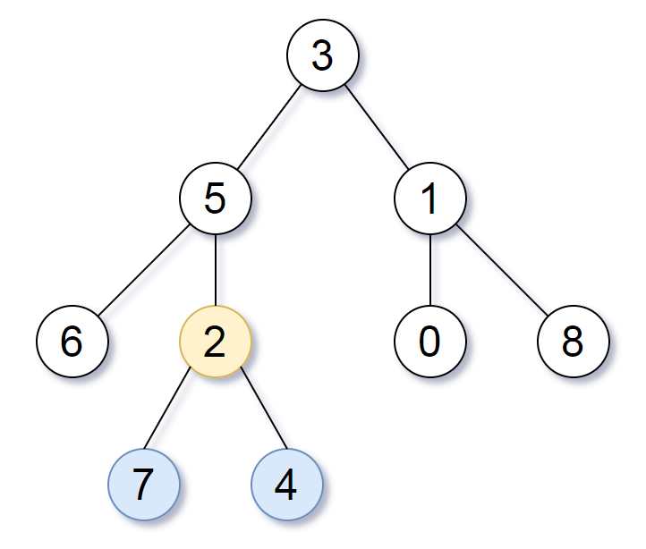

# 865 具有所有最深结点的最小子树

给定一个根为 root 的二叉树，每个结点的深度是它到根的最短距离。

如果一个结点在整个树的任意结点之间具有最大的深度，则该结点是最深的。

一个结点的子树是该结点加上它的所有后代的集合。

返回能满足“以该结点为根的子树中包含所有最深的结点”这一条件的具有最大深度的结点。

示例：

输入：\[3,5,1,6,2,0,8,null,null,7,4\] 

输出：\[2,7,4\] 解释：



我们返回值为 2 的结点，在图中用黄色标记。 在图中用蓝色标记的是树的最深的结点。

 输入 "\[3, 5, 1, 6, 2, 0, 8, null, null, 7, 4\]" 是对给定的树的序列化表述。 

输出 "\[2, 7, 4\]" 是对根结点的值为 2 的子树的序列化表述。 输入和输出都具有 TreeNode 类型。


此题本质就是找到一个左右子树的深度相同的节点

```java
/**
 * Definition for a binary tree node.
 * public class TreeNode {
 *     int val;
 *     TreeNode left;
 *     TreeNode right;
 *     TreeNode(int x) { val = x; }
 * }
 */
class Solution {
    public TreeNode subtreeWithAllDeepest(TreeNode root) {
        Result res = find(root);
        return res.node;
    }

    private Result find(TreeNode root) {
        if (root == null) {
            return new Result(0, null);
        }
        Result l = find(root.left);
        Result r = find(root.right);
        int dl = l.depth;
        int dr = r.depth;
        Result res = new Result(
            Math.max(dr, dl) + 1,
            (dr == dl) ? root : dr > dl ? r.node : l.node);
        return res;
    }

    class Result {
        int depth;
        TreeNode node;
        Result(int depth, TreeNode node) {
            this.depth = depth;
            this.node = node;
        }

    }
}
```


